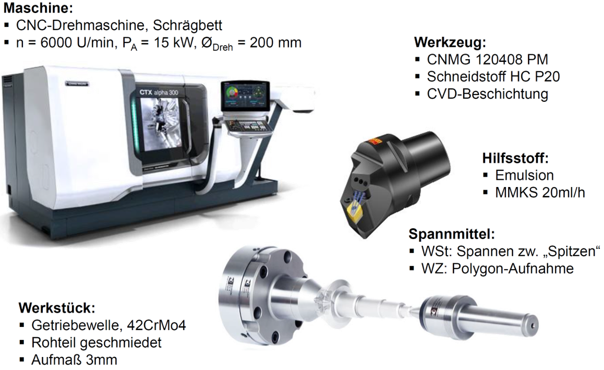
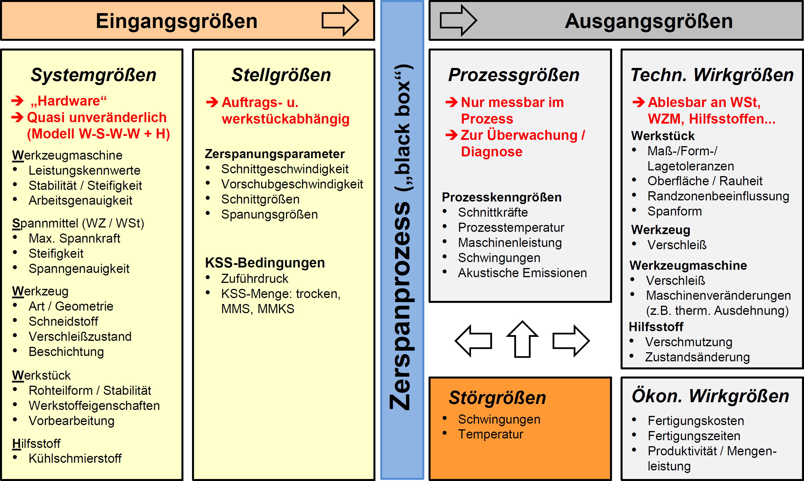
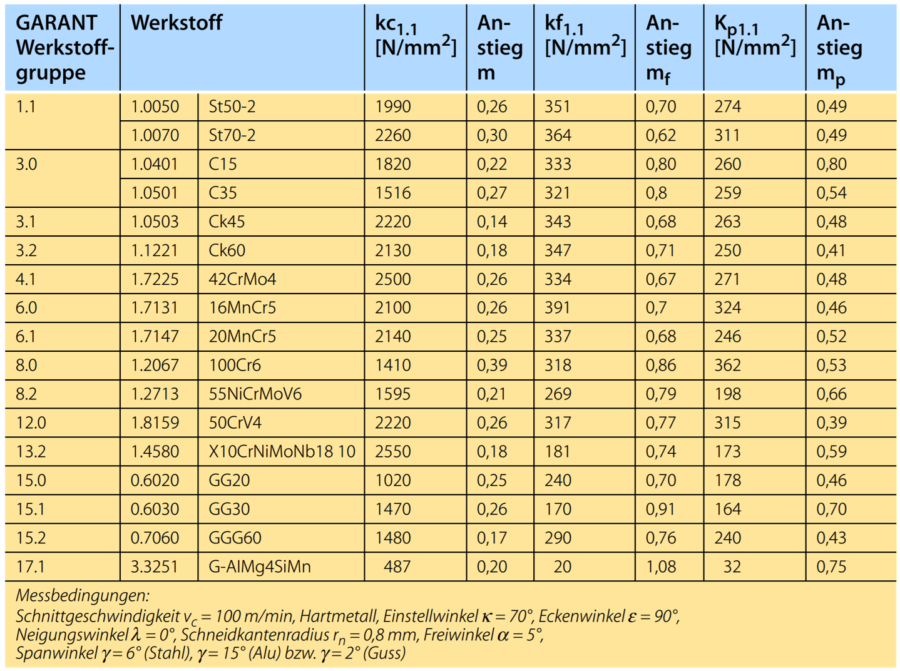
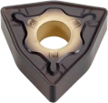
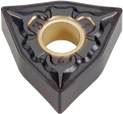
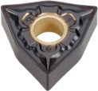
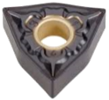

<!--

author:   Nancy Brinkmann, Ronny Stolze

email:    nancy.brinkmann@hs-magdeburg.de, ronny.stolze@hs-magdeburg.de

version:  1.0.0

language: de_DE

narrator: DE FEMALE

-->

# **Gesamtsystem WSWW+H**

<h2>Versuchsvorbereitung</h2>

Jede Gruppe erhält ein Drehwerkzeug, mit dem die in den Kursen beschriebenen Versuche durchzuführen sind. Bevor Sie mit den Versuchen starten, verschaffen Sie sich einen Überblick über die verwendete Technik und
ergänzen auf den folgenden Seiten die fehlenden Daten, um Ihr Gesamtsystem **WSWW + H** beschreiben zu können.

 
Durch das Systemmodell **WSWW + H** werden wesentliche Eingangsgrößen für den Zerspanprozess beschrieben. Es setzt sich zusammen aus:

<!--
style="font-size: 18px; "
-->
**W**erkzeugmaschine  
**S**pannmittel 
**W**erkstück 
**W**erkzeug 
**H**ilfsstoffe

 
<!--
style = "width: 100%; border: 1px solid; "
-->

<!--
style="font-size: 14px; width: 100%; margin: 0.25em 1;"
-->
***Abbildung:*** *Gesamtsystem WSWW+H*

## **W**erkzeugmaschine

Hier finden Sie wichtige Informationen zur vorhandenen Maschinentechnik.

 

<!--
style="width: 100%; "
-->
|$ \quad $ Bezeichnung | Drehmaschine EMCOMAT E-300, zyklengesteuert |
|$ \quad $ Spitzenweite  | 1.500 mm  |
|$ \quad $ Umlauf-$\varnothing$ über Bett	|570 mm|
|$ \quad $ Umlauf-$\varnothing$ über Schlitten |340 mm|
|$ \quad $ Vorschubkraft X max.| 10 kN|
|$ \quad $ Vorschubkraft Z max.| 15 kN|
|$ \quad $ Spindeldrehzahl|0 - 2.500 U/min|
|$ \quad $ Drehzahlregelung|stufenlos|
|$ \quad $ Antriebsleistung bei 40/100 % ED| 25/17 kW |
|$ \quad $ max. Nennmoment an der Hauptspindel|764/519 Nm|

## **S**pannmittel

Bitte tragen Sie hier die geforderten Informationen zum Teilsystem **S**pannmittel ein.

 

Art der Spannung

[[___ ___ ___]]

verwendete Spannmittel

[[___ ___ ___]]

Besonderheiten

[[___ ___ ___]]

## **W**erkstück

Bitte tragen Sie hier die geforderten Informationen zum Teilsystem **W**erkstück ein.

 

Bezeichnung

[[___ ___ ___]]

Abmaße ($\varnothing \space x \space l$)

[[___ ___ ___]]

**W**erkstoff

[[___ ___ ___]]

Härte

[[___ ___ ___]]

## **W**erkzeug

Bitte tragen Sie hier die geforderten Informationen zum Teilsystem **W**erkzeug ein.

 

Halterbezeichnung

[[___ ___ ___]]

Wendeschneidplatte

[[___ ___ ___]]

Schneidstoff

[[___ ___ ___]]

Eckenradius

[[___ ___ ___]]

Eckenwinkel

[[___ ___ ___]]

## **H**ilfsstoffe

Bitte tragen Sie hier die geforderten Informationen zum Teilsystem **H**ilfsstoffe ein.

 

Kühlschmierstoff

[[___ ___ ___]]

# **Anhang**

## Systembetrachtung Spanen

<!--
style = "width: 100%; "
-->

<!--
style="font-size: 14px; width: 100%; margin: 0.25em 1;"
-->
***Abbildung:*** *Der Zerspanprozess als System*

## Hauptwerte der spezifischen Kraftkomponenten und deren Anstiegswerte

<!--
style = "width: 100%; "
-->

## Im Praxisteil verwendete Wendeschneidplatten

<!--
style="width: 100%; "
-->
|  |  | Startwerte | | |
|--- |:---: |--- |--- | ---|
| **Wendeschneidplatte** | | **ap** in mm | **fn** in mm/U | **vc** in m/min |
|WNMG 080412 – WSS HB7020 | <!--
style = "width: 50%; "
--> |0,3 – **1,4** – 2,5  | 0,1 – **0,3** – 0,5 | 100 – **190** – 280|
|WNMG 080408 – WSS HB7020 | <!--
style = "width: 50%; "
--> |0,3 – **1,4** – 2,5  | 0,1 – **0,3** – 0,5 | 100 – **190** – 280|
|WNMG 080408 – SS HB7020 | <!--
style = "width: 50%; "
--> |0,2 – **1,1** – 2  | 0,1 – **0,25** – 0,4 | 150 – **280** – 400|
|WNMG 080404 – SS HB7020 | <!--
style = "width: 50%; "
--> |0,2 – **1,1** – 2  | 0,1 – **0,25** – 0,4 | 150 – **280** – 400|
| | | | | |
|CNMG 120408 – WSS HB7020 | <!--
style = "width: 50%; "
--> |0,3 – **1,4** – 2,5  | 0,1 – **0,3** – 0,5 | 100 – **190** – 280|
|CNMG 120408 – SS HB7020 | <!--
style = "width: 60%; "
--> |0,2 – **1,1** – 2  | 0,1 – **0,25** – 0,4 | 150 – **280** – 400|
|CNMG 120404 – SS HB7020 | <!--
style = "width: 50%; "
--> |0,2 – **1,1** – 2  | 0,1 – **0,25** – 0,4 | 150 – **280** – 400|
|CNMG 120412 – WSS HB7020 | <!--
style = "width: 50%; "
--> |0,3 – **1,4** – 2,5  | 0,1 – **0,3** – 0,5 | 100 – **190** – 280|
| | | | | |
|DNMG 110408 – SS HB7020 | <!--
style = "width: 40%; "
--> |0,2 – **1,1** – 2  | 0,1 – **0,25** – 0,4 | 150 – **280** – 400|
|DNMG 110404 – SS HB7020 | <!--
style = "width: 40%; "
--> |0,2 – **1,1** – 2  | 0,1 – **0,25** – 0,4 | 150 – **280** – 400|
|DNMG 110408 – WSS HB7020 | <!--
style = "width: 40%; "
--> |0,3 – **1,4** – 2,5  | 0,1 – **0,3** – 0,5 | 100 – **190** – 280|
